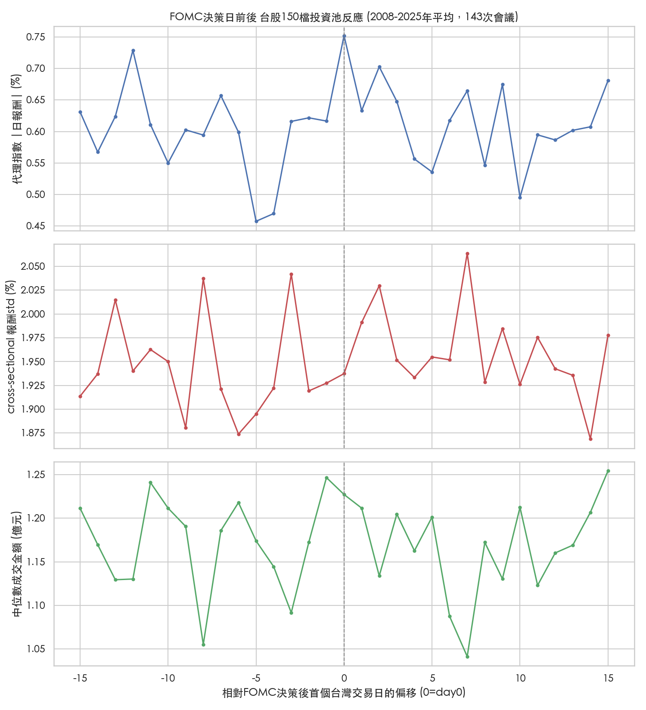

# FOMC利率決策對台股(150檔投資池)的影響 — 與Q3財報比較

給隊友快速消化用。純描述性分析，**不含選股/策略邏輯**。對應腳本：`src/eda_fomc_event_study.py`，完整輸出見 `analysis/run_output_fomc_event_study.txt`。

## 背景

比賽視窗(10/26-11/27)剛好涵蓋 **2026/10/27-28 FOMC會議**，決策公布時間是美東10/28下午2點，換算台灣時間是 **10/29凌晨2點**——台灣股市在10/29(比賽開賽後第4個交易日)開盤前就會知道結果。這比11/14的Q3財報截止日還早，是比賽視窗前段最早的一個確定總體事件。

## 資料來源：FOMC會議日期怎麼來的

沒有現成的政府「FOMC日期API」，但 federalreserve.gov 官方頁面本身是結構化的靜態HTML，可以直接爬：

- 2008-2020年：`federalreserve.gov/monetarypolicy/fomchistorical{年}.htm`（逐年歷史頁）
- 2021-2026年：`federalreserve.gov/monetarypolicy/fomccalendars.htm`（近年彙整頁）

用 `requests` 直接抓原始HTML、regex解析（不是用會做摘要、可能出錯的AI工具處理），並交叉檢查修掉了幾個解析陷阱（跨月會議如「July 31-August 1」、縮寫月份「Jan/Feb 31-1」、以及2025年一筆非決策性的「notation vote」誤判），最終取得 **2008-2025年共143次例行會議**的決策日期（每年8次，2020年因COVID臨時加開的3次非例行會議不計入）。這個方法比對「Q3財報截止日」用的近似日期扎實很多——FOMC日期是精確的，不像財報截止日只能用法規期限去近似。

## 重要方法論修正：mean → median

第一版用平均數(mean)聚合時，發現 `price_volume.csv` 裡已知的「還原權值批次重算單日跳動雜訊」（見 `rev_prof_net_summary.md`／`summary.md` 都提過這個已知問題）在2014-07-15、2022-02-15兩天造成單一個股報酬失真（cross-sectional std一度衝到1204%），把特定offset的平均數拉爆。改用中位數(median)聚合後兩個event study(FOMC、Q3財報)都重新確認過，結果穩定許多。

## 結果：FOMC vs Q3財報，兩種不同性質的風險

| 指標 | Q3財報截止日(11/14錨點) | FOMC決策日 |
|---|---|---|
| Cross-sectional 分歧度(個股間差異程度) | 1.05x | 1.03x |
| **市場整體方向性幅度**(150檔等權重代理指數\|日報酬\|) | **0.92x**（甚至略降） | **1.16x**（明顯放大，且day0當天是整個±15日窗口的最高點） |
| 成交金額 | ~1.05x | 1.03x |

**這證實了兩者是不同性質的風險，不是單純誰比誰大或小：**

- **Q3財報**是個股異質性(idiosyncratic)事件——各公司各自不同時間公布、方向也彼此抵銷，所以「大盤一起動」的幅度沒有放大（甚至略降到0.92x），但個股間分歧度理論上該放大，只是我們用固定法定截止日當錨點量出來的效果被稀釋了（見 `q3_earnings_event_study_summary.md`）。
- **FOMC**是系統性(systematic)總體衝擊——不管你手上是哪150檔，同一天全部同時知道同一個利率決策，所以「大盤一起動」的幅度確實放大到1.16x，而且day0當天剛好是整個±15交易日窗口裡代理指數\|報酬\|最高的一天，圖上看得到清楚的單日尖峰。分歧度則沒有跟著放大(1.03x)，跟財報的1.05x差不多——符合「大家同時往同個方向動、彼此差異不會特別拉開」的直覺。

## 跟比賽的關係

1. **FOMC(10/29台灣時間反應)是比賽視窗前段最早、最集中的一次系統性風險事件**，發生在Q3財報截止日(11/14)之前，且從歷史型態看它比財報公布更可能讓大盤整體同步震盪，而不是拉開個股分歧——風控上，這天前後可能更適合看「整體曝險/beta」而不是「哪檔特別怪」。
2. 財報季的重點在「挑股票」（哪家公司財報好，見前一份摘要），FOMC的重點在「大盤會不會一起動」——兩者是互補的風險，不需要用同一套邏輯處理。
3. 這是2008-2025年**18年歷史平均型態**，樣本已經涵蓋金融海嘯、QE、升息循環、降息循環等不同利率環境，型態算是相對穩健，但2026年實際會怎麼走仍不保證重演。
