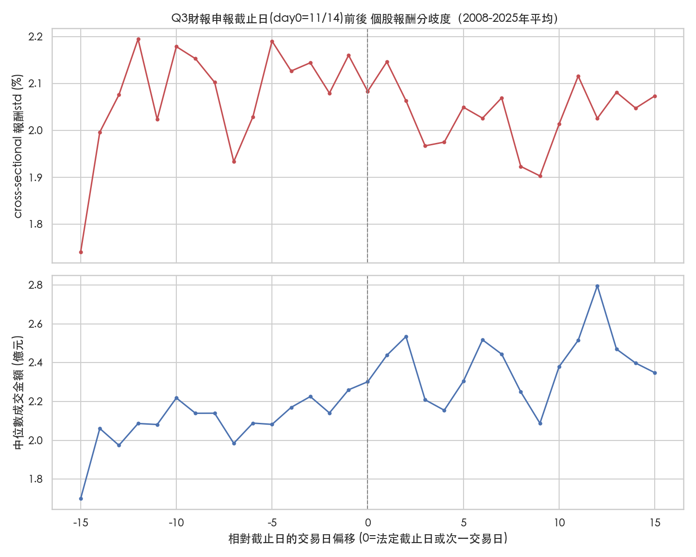
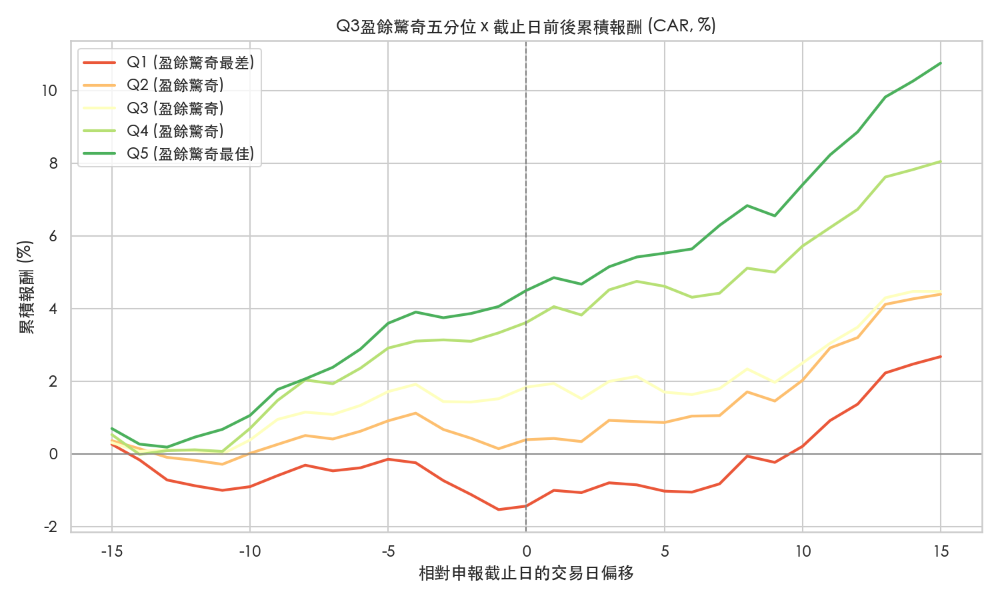

# Q3財報公布對股價的影響 — Event Study 摘要

給隊友快速消化用。純描述性分析，**不含選股/策略邏輯**。對應腳本：`analysis/eda_q3_earnings_event_study.py`，完整輸出見 `analysis/run_output_q3_event_study.txt`。

## 重要限制：沒有逐檔精確公告日期

`data/rev_prof_net.csv` 只有「財報所屬季度」（年/月），**沒有每家公司實際申報的日期**。這裡用台股法規慣例做近似：Q3(7-9月)財報法定申報截止日是季末後45日 = **11/14**，實務上大量公司集中在截止日前幾天才申報（拖到最後一刻是常態），所以用 11/14 當市場層級的事件錨點(day0)是合理近似，但**不是每一檔股票的精確公告日**——如果後續要做逐檔精確事件研究，需要另外抓 TWSE/MOPS 的實際申報日期資料，目前沒有做這塊。

分析範圍：150檔投資池、2008-2025年（2008年前僅半年報，見 `rev_prof_net_summary.md` A4），事件窗為 day0 前後各15個交易日。

---

## A. 市場層級：截止日前後的分歧度/成交量 — 效果比想像中弱

用固定日期(11/14)當錨點看，**截止日附近(day0 ~ +3)的個股報酬分歧度只比窗外(|offset|>5)高 1.02倍，中位數成交金額只高 1.05倍**——沒有出現「財報公布當天全市場劇烈震盪」的明顯尖峰。成交量圖比較有意義的訊號是：截止日之後的1-2週(約day+5~+12)有一段緩步墊高，在day+12附近見高點，比較像「陸續消化財報」的漸進效應，而不是單日爆量。

這跟先前 `analysis/summary.md` 的09圖（財報密集期 vs 全年其他，用整段11/10-11/14 vs 全年比較）方向一致但程度更保守：09圖用中位數比較時財報密集期(2.14%)確實略高於全年其他(2.04%)，但差距同樣只有約5%，本來就不是「明顯放大」的等級，只是原摘要文字用詞稍微誇大了。**跟比賽的關係**：不需要特別為了11/14前後幾天單獨加碼風控，市場整體沒有出現異常尖峰；但要注意這是「用固定日期錨點」算出的平均效果——因為150檔的真實申報日其實分散在45天窗口內各不相同，個別公司在「自己實際公告的那一天」的反應理論上會比這個平均後的圖更劇烈，只是我們手上沒有精確日期去驗證。

## B. 個股層級：盈餘驚奇 x 事後累積報酬 — 有清楚、可辨識的方向性訊號

用每檔股票「Q3合併總損益 YoY成長率」（相對於自己去年同季）當「盈餘驚奇」代理指標，每年橫斷面分五等分，追蹤各分位在截止日前後30個交易日的累積報酬（1,968個公司-年觀察值）：

| 分位(YoY成長中位數) | day0累積報酬 | day+15累積報酬 |
|---|---|---|
| Q1 最差 (-67.6%) | -1.44% | +2.68% |
| Q2 (-11.1%) | +0.39% | +4.40% |
| Q3 (+13.6%) | +1.84% | +4.48% |
| Q4 (+50.9%) | +3.62% | +8.05% |
| Q5 最佳 (+202.1%) | +4.50% | +10.76% |

五條線在整個事件窗內排列非常整齊（Q5持續在最上面、Q1持續在最下面），Q5比Q1在31個交易日內累積多賺約**8個百分點**。

**但關鍵細節：這個價差大部分在截止日「之前」就已經形成**——day(-15)到day0，Q5已經比Q1多漲約5.5個百分點（-1.5% vs +4.1%），推測是因為台股月營收會比季報更早公布，市場其實已經透過月營收提前消化方向；截止日「之後」到day+15，各分位仍持續分化但幅度較小且不完全單調（約+2.6%~+6.3%，Q5仍明顯最高、但Q2/Q3順序略有雜訊，樣本量約每分位390檔-年，年度間差異可能造成雜訊）。

**跟比賽的關係**：
1. Q3盈餘驚奇對股價有真實、可辨識的方向性訊號，但**訊號有相當比例在正式財報公布前就已反映**（很可能來自月營收），單純等季報數字出來才反應會慢半拍。若要用基本面驚奇當因子，應該搭配月營收類的領先指標，而不是只看季報本身。
2. 比賽視窗(10/26-11/27)橫跨截止日(11/14)前後，根據這個歷史型態：視窗前段（10/26-11/13）比較可能是「隨月營收/預期提前反應」的階段，視窗後段（11/14-11/27）則是季報正式公布後仍有機會延續（但較弱）的漂移階段。
3. 這是**歷史平均型態**，樣本橫跨18年、不代表2026年一定重演，且分位間的排序在中段(Q2/Q3)不算穩健，只有頭尾兩端(Q1最差/Q5最佳)的方向性比較可信賴。

---

## 三個重點結論

1. 用法定截止日(11/14)當市場層級錨點看，全市場的分歧度/成交量在截止日附近只有溫和放大（約1.02-1.05倍），沒有出現劇烈單日尖峰；成交量在截止日後1-2週有漸進式墊高。
2. 個股層級上，Q3盈餘YoY成長率(盈餘驚奇)與後續30個交易日累積報酬有清楚的正向關係（最佳分位比最差分位多賺約8個百分點），是可能有用的基本面因子。
3. 但這個訊號大部分在正式財報公布**前**就已反映（可能來自月營收），公布**後**的增量漂移較小、中段分位排序也不夠穩健——若要精確捕捉「公布當下」的反應，需要補上每家公司實際申報日期（目前資料集沒有），而不是只靠法定截止日近似。
