# 150檔投資池 — 市場環境探索分析摘要

給隊友快速消化用。純描述性分析，**不含選股/策略邏輯**。

資料基準：150檔比賽池、781,623筆、2000-01-04~2026-09-17。近期橫斷面統計以 2026-09-17 為基準日。

---

## A. 投資池基本輪廓

### 01 產業分布

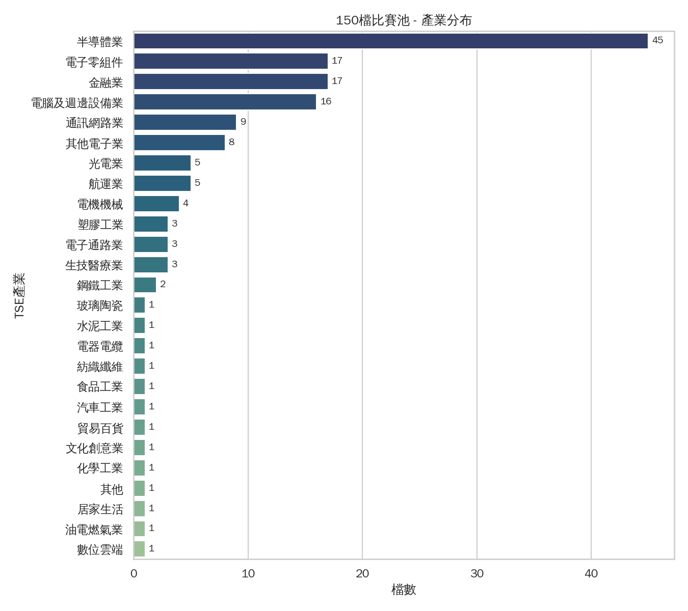

150檔中**半導體業45檔（30%）**，加上電子零組件17、金融業17、電腦及週邊設備業16，前四大類就佔了95檔（63%）。其餘26個產業類別大多只有1-5檔。

**跟比賽的關係**：投資池結構性地高度集中在科技/半導體，代表整體投組report很難真正跟大盤脫鉤——半導體產業的系統性事件（例如AI供應鏈消息、記憶體報價）會同時影響一大票候選股，這對「20-30檔、單股上限10%」的分散要求是隱性壓力，也呼應下面07相關性分析。

### 02 上市歷史/資料長度分布

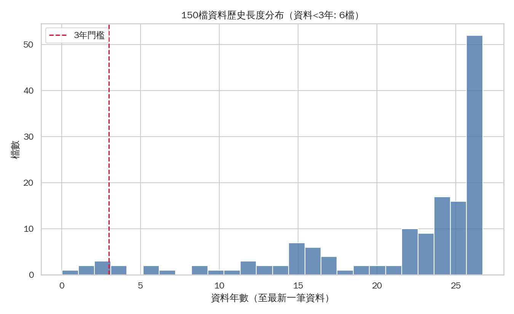

多數股票資料長度落在20-27年（歷史悠久），但有 **6檔資料不到3年**：3718中光電投控（僅11筆，2026-09-03才掛牌！）、7828創新服務（336筆）、7769鴻勁（458筆）、7750新代/7751竑騰（~550筆）、7734印能科技（613筆）。

**跟比賽的關係**：這幾檔如果被選入投組，任何用到中長期歷史（動能、波動度估計、相關性）的判斷基礎都很薄弱，3718甚至完全沒有可用歷史。這點在03/04/07都有對應排除處理。

### 03 流動性分布（近1年日均成交金額）

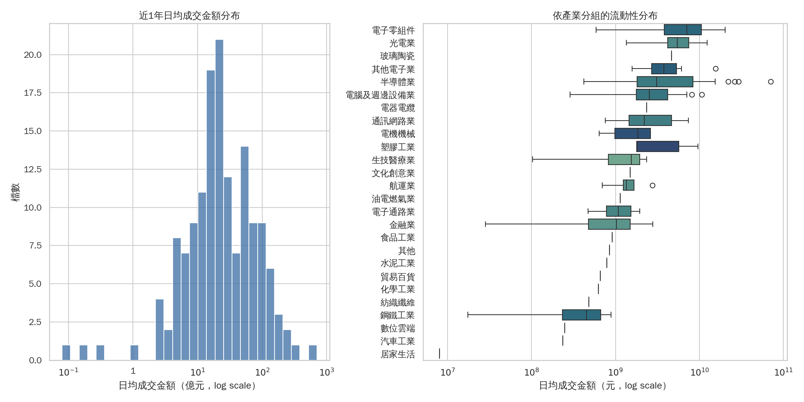

近1年日均成交金額中位數 **22.8億元**，但分布右偏嚴重（mean 45.9億 遠高於中位數，最大 706億）。**流動性最低10檔**：5903全家(0.08億)、8415大國鋼(0.17億)、6023元大期(0.28億)、4123晟德(1.02億)、2207和泰車(2.36億)、2812台中銀(2.44億)、8932智通(2.49億)、6121新普(2.86億)、5876上海商銀(3.57億)、5880合庫金(4.02億)。

**跟比賽的關係**：注意最低流動性名單裡有幾檔其實是大家熟知的大型股（和泰車、台中銀、上海商銀、合庫金），代表「知名/大型」不等於「這個資料集裡日均成交金額高」——選股時流動性要另外查證，不能只憑印象。

### 04 波動度分布（近1年年化，依產業分組）

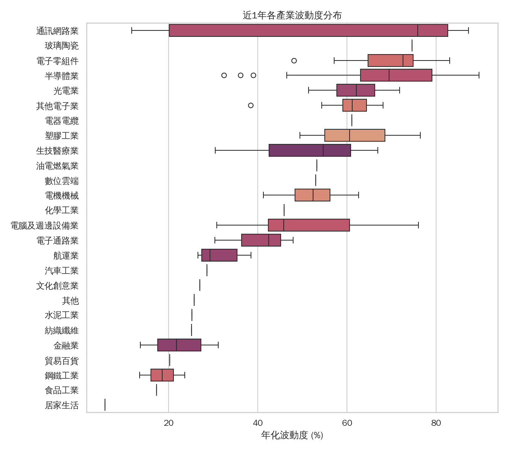

近1年年化波動度**中位數高達60.6%**（mean 53.8%），這個數字明顯偏高（一般台股正常年份中位數多落在20-40%區間），顯示這是波動特別劇烈的一年。**波動度最高10檔**：4991環宇-KY(89.6%)、2408南亞科(89.2%)、2337旺宏(88.9%)、7828創新服務(88.2%)、3081聯亞(87.3%)、2344華邦電(86.7%)、7751竑騰(86.1%)、3163波若威(84.5%)、8358金居(83.0%)、4979華星光(82.6%)——記憶體/半導體相關股票明顯集中在高波動端。產業別來看通訊網路業、半導體業、電子零組件的波動度分布也明顯高於金融業、鋼鐵工業等傳產。

**跟比賽的關係**：這批高波動股票如果被選入，光是單日振幅就可能逼近單股10%持股上限的風控邊界，需要在部位大小上額外保守。

---

## B. 近期市場狀態（進場前的體檢）

### 05 代理指數滾動波動度（近3年）

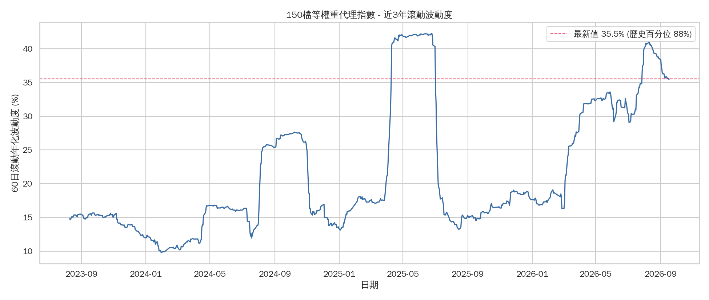

以150檔等權重日報酬組成的代理指數，60日滾動年化波動度目前（2026-09-17）為 **35.51%**，落在近3年區間的 **87.6百分位**——也就是說，我們即將進場的這個時間點，波動度是近3年來偏高的區域，接近2025年中出現過的高峰（~42%，對應先前查到的2025/4「對等關稅」全球股災）。近3年還可以看到2024下半年、2025上半年都各出現過一波波動急升，顯示這一年多市場並不平靜。

**跟比賽的關係**：開賽當下不是風平浪靜的「低波動期」，而是相對偏熱的環境，風控（單股上限、現金水位）要用偏保守的假設去準備，不能套用「正常年份」的直覺。

### 06 動能橫斷面快照（1M/3M/6M，基準日2026-09-17）

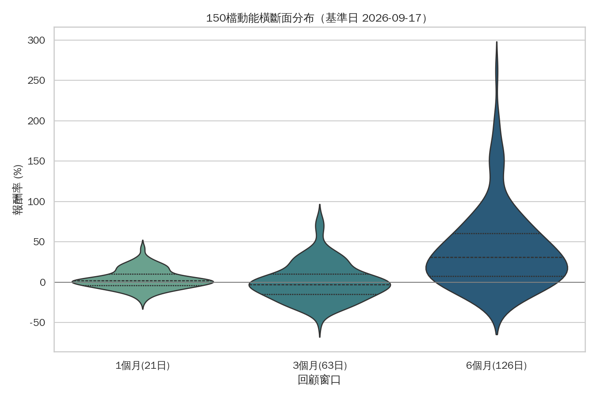

近1個月平均報酬 +3.8%、近3個月幾乎打平(+0.6%)、但**近6個月平均高達+40.7%**（std 49.3%，右偏極端）。6個月報酬最高：2059川湖(+261.8%)、6182合晶(+201.9%)、6147頎邦(+195.0%)、1303南亞(+175.1%)、2454聯發科(+161.7%)；最低：6919康霈(-28.5%)、4772台特化(-24.4%)、4123晟德(-23.2%)、4749新應材(-19.2%)、2337旺宏(-18.8%)。

**跟比賽的關係**：這代表過去半年是一波非常集中的（可能是AI/半導體驅動的）結構性大行情，同時個股間分歧極大（有股票6個月漲261%、也有跌近30%的）。進場時這批股票的估值/位階差異已經很懸殊，純粹「順勢加碼強勢股」的做法風險與報酬都會被放大。

### 07 報酬相關性結構（近1年，階層聚類）

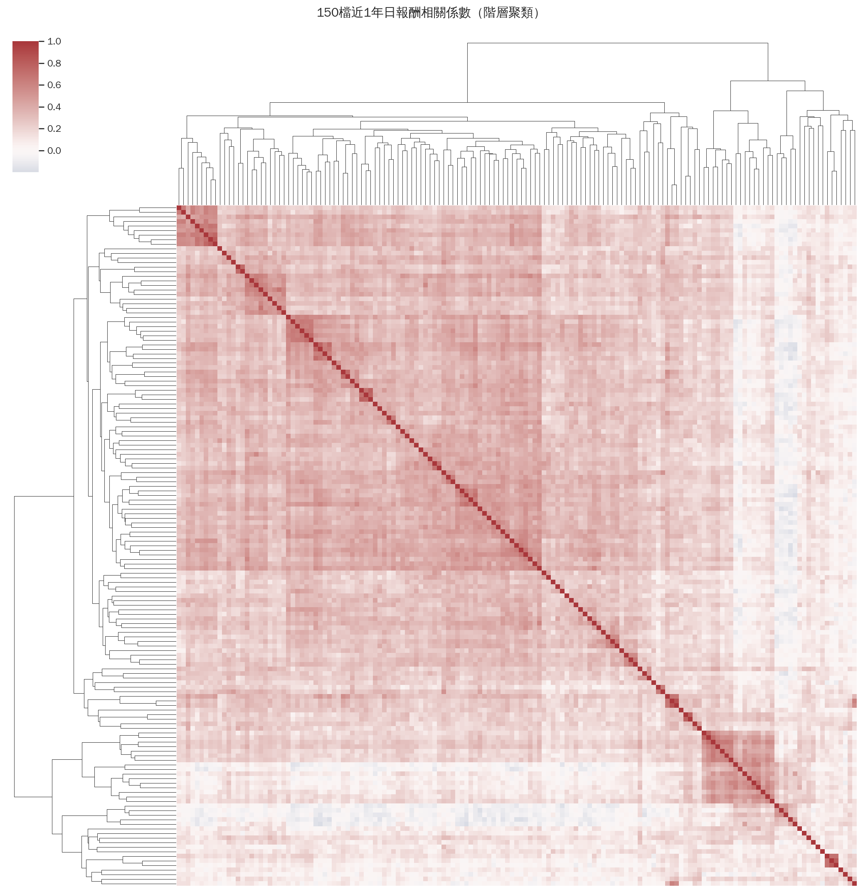

150檔近1年日報酬兩兩相關係數，**平均0.226、中位數0.234**——整體偏中低度相關，代表投資池本身仍有一定分散空間，並非齊漲齊跌的單一因子市場。聚類圖可以看到幾個明顯較高相關的子族群（左上角、右下角深色區塊），推測對應到半導體/電子供應鏈這類連動性高的次族群。

**跟比賽的關係**：20-30檔的持股要求下，若集中選在同一個高相關子族群（例如都選半導體上下游），實質分散效果會遠低於「持股數字看起來夠多」，這點在後續配置時值得注意（但此處只是現象描述，不展開建議）。

---

## C. 比賽視窗季節性分析（財報季變數的量化呈現）

### 08 比賽視窗 vs 全年其餘 報酬分布

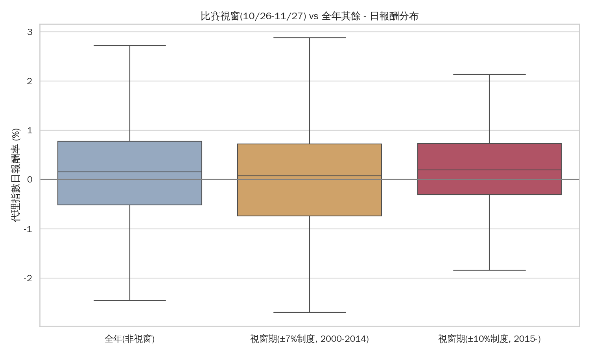

三組比較（2000-2025歷年）：全年(非視窗) 平均日報酬 0.108%／std 1.98%；視窗期舊制(±7%，2000-2014) 平均 0.001%／std 1.58%；視窗期新制(±10%，2015-) 平均 0.188%／std 0.95%。**2015年後的比賽視窗期，日報酬波動度明顯比全年其他時間低（0.95% vs 1.98%），平均報酬也略高**。但樣本數只有258個交易日（約11年×24天），屬於初步觀察，不宜過度解讀為「這段期間穩賺」。

**跟比賽的關係**：至少從代理指數（大盤層級）角度看，近年比賽視窗期不是特別動盪的期間；真正的風險落在下一張圖看到的「個股間分歧度」，而不是整體市場方向。

### 09 財報三階段 - 個股橫斷面離散度

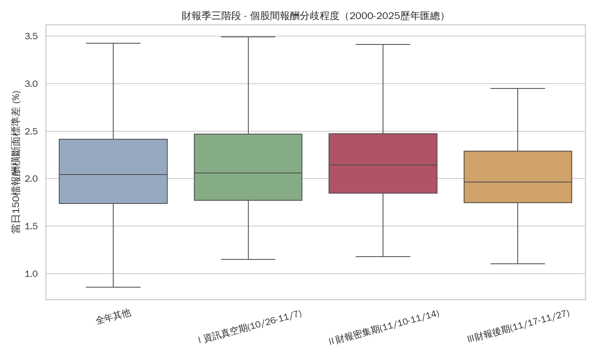

把歷史視窗切三段，看「當天150檔報酬的標準差」（分歧程度指標）：Ⅰ資訊真空期(10/26-11/7) median 2.06%；**Ⅱ財報密集期(11/10-11/14) median 2.14%（三段最高）**；Ⅲ財報後期(11/17-11/27) median 1.96%（三段最低）。方向與預期一致——財報公告最密集的那幾天，個股表現分歧確實比前後兩段都大，雖然差距不算劇烈（約10%相對差異）。註：「全年其他」那組std高達16.5，是因為有像2025/4/7關稅股災這類極端日子拉高，median(2.04%)才是跟前三段比較基準一致的數字。

**跟比賽的關係**：這證實了最初的假設方向——財報密集期(11/10-11/14)個股間表現差異確實會放大，雖然這一版只用日曆推算日期、還沒對到個股實際申報日，之後接上財務資料可以做更精細的「個股距離自己財報日還有幾天」分析。

### 10 比賽視窗 vs 全年其餘 - 流動性比較

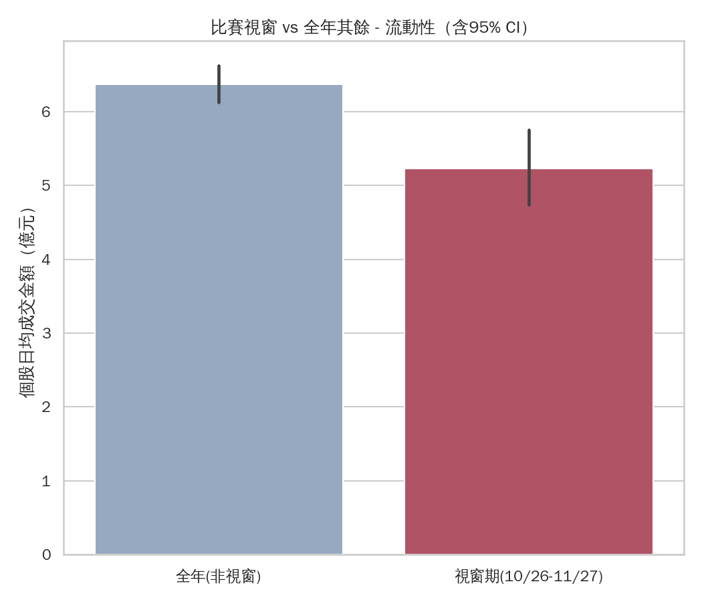

全年(非視窗) 個股日均成交金額 mean 6.37億／median 2.91億；視窗期(10/26-11/27) mean 5.23億／median 2.77億。**跟直覺不同：比賽視窗期的成交量並沒有放大，中位數甚至略低於全年其他時間。**

**跟比賽的關係**：財報季「資訊量增加」不等於「成交量增加」——量能沒有系統性放大，代表執行/撮合面的壓力不大，但個股分歧度（09）仍會提高，兩者合起來看，這段期間真正的風險是「選錯個股方向」而不是「流動性不足」。

---

## D. 資料限制回顧

### 11 零成交量日熱力圖

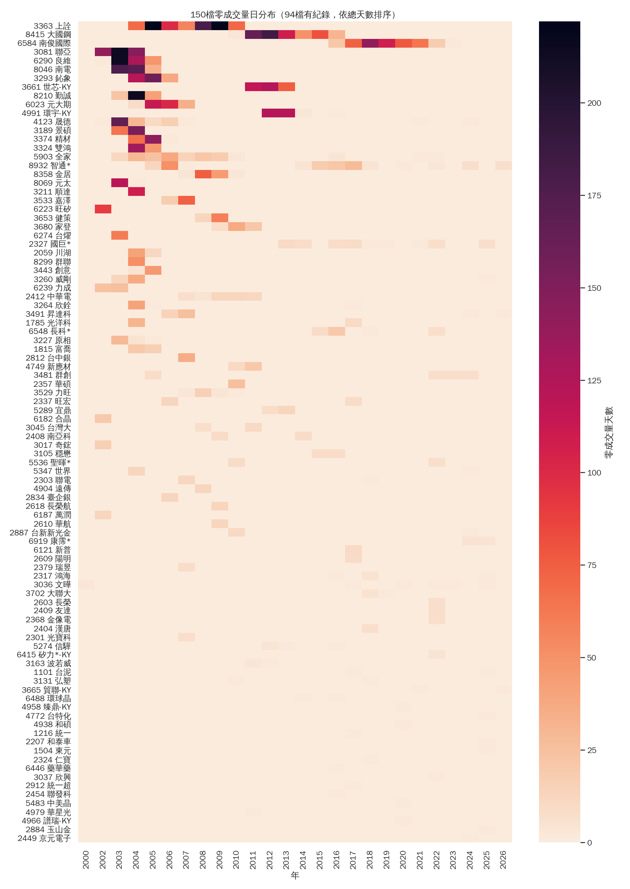

150檔中 **94檔歷史上出現過零成交量日**，絕大多數集中在2002-2013年（早期市場流動性普遍較差），近年已大幅改善。零量天數最多前10檔：3363上詮(919天)、8415大國鋼(624天)、6584南俊國際(504天)、3081聯亞(502天)、6290良維(394天)、8046南電(381天)、3293鈊象(319天)、3661世芯-KY(316天)、8210勤誠(280天)、6023元大期(257天)。其中 **6584南俊國際、8932智通** 兩檔近幾年仍偶有零量日，其餘多屬於歷史問題已隨時間消失。

### 12 資料涵蓋度時間軸

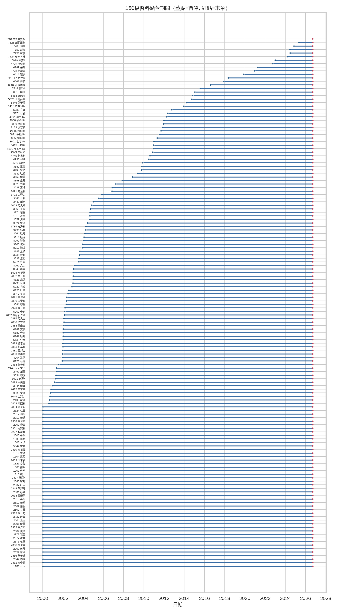

視覺化版本的資料起訖時間軸，驗證與先前文字報告一致：146/150檔完整無缺，僅3081聯亞、4749新應材（各有近10年斷層）、1785光洋科（232天斷層）三檔需要特別處理，詳見記憶 `esun-price-volume-data-quality`。

---

## 三句話總結

1. **投資池結構性偏科技/半導體**，近1年又剛好處在一波高波動、高報酬分歧的AI相關大行情尾聲（滾動波動度處於近3年87百分位），開賽時機不算平靜。
2. **財報密集期(11/10-11/14)個股分歧度確實會放大**，但整體市場方向（08）與成交量（10）沒有明顯異常放大，風險主要是「選錯股」而非「大盤動盪」或「流不動」。
3. 少數股票（短歷史6檔、低流動性10檔、高零量紀錄10檔、斷層3檔）需要在後續建模/選股邏輯裡個別特殊處理，不能套用同一套規則。
